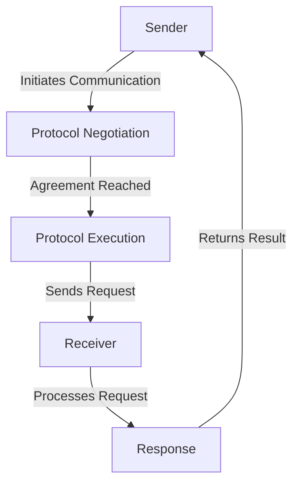

import { Callout, Steps, Step } from "nextra-theme-docs";

# Core Components

The Agora protocol is built on a set of modular components that work together to enable communication between LLM-powered agents. This section covers the core architecture and how these components interact.

<Callout type="info">
While Agora is flexible enough to support various implementations, this documentation focuses on the Python reference implementation (`agora-python`).
</Callout>

## Architecture Overview

At its core, Agora is built around two main types of components:

- **Sender Components**: Handle outgoing communications and protocol negotiation
- **Receiver Components**: Process incoming requests and execute protocols



## Component Interfaces

All components in Agora follow a consistent interface pattern, making it easy to extend or replace them. The core components handle:

- Protocol management and storage
- Communication negotiation
- Code execution in a controlled environment
- Tool integration and execution

<Callout type="warning">
Components should never execute untrusted code directly. Always use the provided [execution environment](/protocol-management/protocol-execution) for safety.
</Callout>

## State Management

Agora uses a robust state management system through the `ProtocolMemory` class, which maintains:

- Protocol documents and metadata
- Conversation history
- Implementation cache
- Suitability ratings

```python
class ProtocolMemory:
    def __init__(self, storage : Storage):
        self.storage = storage
        # Protocols are stored with their metadata, implementations,
        # and suitability ratings
```

## Error Handling

The system provides a comprehensive error handling mechanism through custom exceptions:

- `ProtocolError`: Base class for protocol-related errors
- `ExecutionError`: Issues during protocol execution
- `StorageError`: Problems with protocol storage
- `SchemaError`: Invalid schema definitions

```python
class ProtocolError(Exception):
    pass

class ExecutionError(Exception):
    pass

class StorageError(Exception):
    pass

class SchemaError(Exception):
    pass
```

## Tool Integration

Components can integrate with external tools through the `Tool` interface. Tools can be:

- Functions with schema definitions
- External API integrations
- Custom implementations

<Callout type="tip">
Tools are defined with clear input/output schemas, making them easily composable and reusable across different protocols.
</Callout>

See the [Tool Implementation](/tooling/tool-implementation) section for details on creating custom tools.

## Further Reading

For more detailed information about specific components:

- [Sender Components](/core-components/sender-components)
- [Receiver Components](/core-components/receiver-components)
- [Protocol Execution](/protocol-management/protocol-execution)

<Callout>
While the core components provide a solid foundation, you can extend or modify them to suit your specific needs. Just ensure you maintain the security guarantees, particularly around code execution and protocol validation.
</Callout>