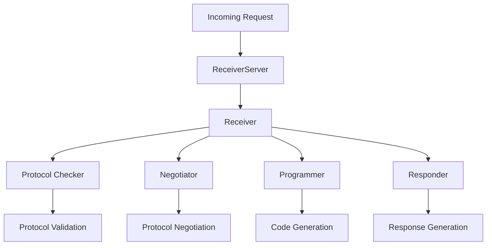

import { Callout, Steps, Step } from "nextra-theme-docs";

# Receiver Components

The receiver components in Agora are responsible for handling incoming communications, executing protocols, and managing responses. These components work together to create a robust system for receiving and processing requests from other agents.

<Callout type="info">
  The receiver components are designed to be modular and extensible, allowing for easy customization and addition of new functionality while maintaining security and reliability.
</Callout>

## Architecture Overview



## Core Components

### Protocol Checker

The Protocol Checker evaluates whether the receiver has the necessary capabilities to implement a given protocol. It uses the provided tools to determine if a protocol can be adequately supported.

```python
checker = ReceiverProtocolChecker(toolformer)
is_adequate = checker(protocol_document, tools)
```

Key responsibilities:
- Validate protocol requirements
- Check tool availability
- Assess implementation feasibility

### Negotiator

The Negotiator handles protocol negotiation sessions with other agents. It helps establish mutually agreeable protocols for communication when standard protocols aren't available.

<Callout type="warning">
Negotiation is a resource-intensive process and should be used sparingly. The system is designed to cache and reuse successful protocols.
</Callout>

### Programmer

The Programmer component generates Python code to implement protocols. It creates executable implementations based on protocol specifications and available tools.

Example of generated code structure:
```python
def reply(query, memory):
    # Protocol implementation
    return response, updated_memory
```

### Responder

The Responder manages the actual communication with the sender, either using:
- Protocol-based responses
- Natural language responses (when no protocol is available)

## Implementation Details

<Steps>
### Step 1: Request Processing

The ReceiverServer accepts incoming requests and routes them to the appropriate handler:
- Protocol-based requests
- Negotiation requests
- Multi-round conversations

### Step 2: Protocol Management

The system checks for existing protocols and their suitability:
- Cached protocols are evaluated first
- New protocols are validated
- Unsuitable protocols trigger negotiation

### Step 3: Response Generation

The system generates responses using either:
- Implemented protocol code
- Dynamic response generation
- Natural language processing
</Steps>

## Memory Management

The receiver maintains protocol memory through the `ReceiverMemory` class, which tracks:
- Protocol suitability
- Implementation status
- Conversation history
- Protocol metadata

```python
memory = ReceiverMemory(storage)
memory.register_new_protocol(
    protocol_id,
    protocol_document,
    protocol_sources,
    metadata
)
```

## Security Considerations

<Callout type="error">
All executed code runs in a restricted environment to prevent unauthorized operations. The system uses RestrictedExecutor by default.
</Callout>

The receiver implements several security measures:
- Protocol validation
- Code execution restrictions
- Memory isolation
- Request rate limiting

## Integration with Tools

Tools are integrated through a standardized interface and are made available to protocol implementations. See the [tooling section](/tooling) for more details on tool integration.

## Error Handling

The system provides robust error handling through custom exceptions:
- ProtocolRejectedError
- ProtocolRetrievalError
- ExecutionError

Errors are propagated appropriately and can trigger fallback mechanisms such as natural language communication.

## Performance Considerations

To optimize performance, the receiver:
- Caches protocol implementations
- Maintains conversation states
- Implements timeout mechanisms
- Uses efficient protocol storage

<Callout>
Implementation thresholds can be configured to balance between dynamic responses and code generation. By default, the system generates implementations after 5 successful conversations using the same protocol.
</Callout>

For more details on the underlying protocol management, see the [protocol management section](/protocol-management).