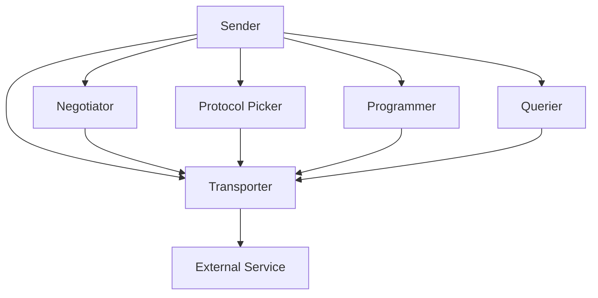

import { Callout, Steps, Step } from "nextra-theme-docs";

# Sender Components

Sender components are the building blocks responsible for initiating and managing outgoing communications in the Agora protocol. These components work together to enable agents to effectively communicate, negotiate protocols, and execute tasks.

<Callout type="info">
The sender side of Agora is designed to be modular, allowing you to customize or replace individual components while maintaining the overall architecture.
</Callout>

## Architecture Overview

Here's how the sender components interact:



## Core Components

### Negotiator (SenderNegotiator)

The negotiator is responsible for establishing new protocols with other agents. It handles the protocol negotiation process when no suitable existing protocol is found.

```python
protocol = negotiator.negotiate_protocol_for_task(
    task_schema,
    callback,
    additional_info
)
```

<Callout type="info">
The negotiator uses a maximum number of rounds (default: 10) to reach an agreement. If no agreement is reached within these rounds, the negotiation fails.
</Callout>

### Protocol Picker (ProtocolPicker)

The protocol picker evaluates existing protocols to determine if they're suitable for a given task. It prevents unnecessary protocol negotiations by reusing existing protocols when possible.

```python
suitable_protocol, evaluations = protocol_picker.pick_protocol(
    task_schema, 
    protocol_list
)
```

### Programmer (SenderProgrammer)

The programmer component generates implementations for protocols. It translates protocol specifications into executable code that can handle the communication.

<Callout type="warning">
The programmer generates code that runs in a restricted environment for security. Make sure your implementation works within these constraints.
</Callout>

### Querier (Querier)

The querier manages the actual communication flow, formatting messages according to protocols and handling responses. It supports both protocol-based and natural language communications.

Key features:
- Maximum query limiting
- Structured output handling
- Error management
- Protocol adherence checking

### Transporter (SenderTransporter)

The transporter handles the actual sending of messages to external services. It manages connections and ensures proper message delivery.

<Callout type="info">
The default implementation (`SimpleSenderTransporter`) uses HTTP for communication, but you can implement custom transporters for different protocols.
</Callout>

## Using Sender Components

Here's how to set up and use sender components:

<Steps>
### Step 1: Initialize Components

```python
from sender.components.negotiator import SenderNegotiator
from sender.components.programmer import SenderProgrammer
from sender.components.protocol_picker import ProtocolPicker
from sender.components.querier import Querier
from sender.components.transporter import SimpleSenderTransporter

negotiator = SenderNegotiator(toolformer)
programmer = SenderProgrammer(toolformer)
protocol_picker = ProtocolPicker(toolformer)
querier = Querier(toolformer)
transporter = SimpleSenderTransporter()
```

### Step 2: Create the Sender

```python
from sender.core import Sender

sender = Sender.make_default(
    toolformer,
    negotiator=negotiator,
    programmer=programmer,
    protocol_picker=protocol_picker,
    querier=querier,
    transporter=transporter
)
```

### Step 3: Execute Tasks

```python
@sender.task(task_id="example_task")
def my_task(input_data: str) -> str:
    """
    Task description
    
    Args:
        input_data: Input string
    
    Returns:
        Processed result
    """
    pass

result = my_task("test input", target="http://example.com")
```
</Steps>

## Advanced Usage

### Custom Transporters

You can implement custom transporters by extending the `SenderTransporter` class:

```python
class CustomTransporter(SenderTransporter):
    def new_conversation(self, target, multiround, protocol_hash, protocol_sources):
        # Implementation
        pass
```

### Error Handling

Sender components use a hierarchical error system defined in [Protocol Management](/protocol-management):

- `ProtocolError`: Base class for protocol-related errors
- `ExecutionError`: For execution failures
- `ProtocolRejectedError`: When a protocol is rejected
- `ProtocolTransportError`: For communication failures

## Integration with Toolformers

The sender components are designed to work with various LLM implementations through the [toolformer interface](/tooling/llm-integration). This allows you to use different LLM providers while maintaining the same communication architecture.

<Callout>
When implementing custom sender components, make sure to maintain consistency with the toolformer interface to ensure compatibility with different LLM implementations.
</Callout>

For more details on implementing tools and integrating with LLMs, see the [Tooling Integration](/tooling) section.