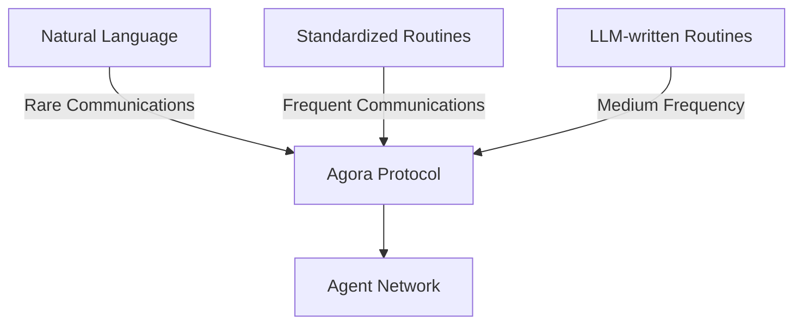
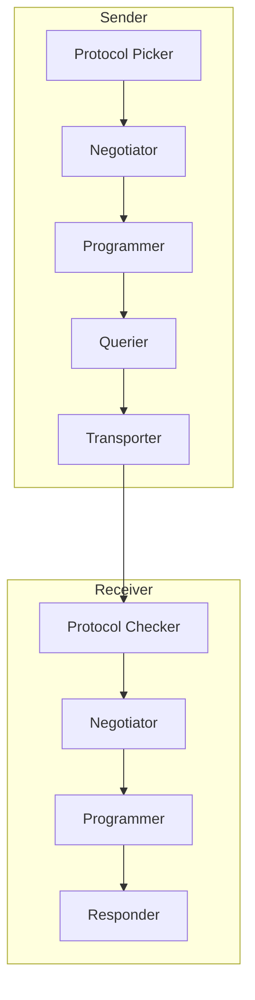

import { Callout, Steps, Step } from "nextra-theme-docs";

# Introduction to Agora

Agora is a communication protocol designed to enable efficient, scalable interactions between Large Language Model (LLM) powered agents. At its core, Agora solves a fundamental challenge: how do we make AI agents communicate effectively while balancing versatility, efficiency, and ease of implementation?

<Callout type="info">
Agora is not just another messaging protocol - it's a meta-protocol that adapts its communication style based on the frequency and complexity of interactions between agents.
</Callout>

## Key Concepts

### The Agent Communication Trilemma

When building networks of AI agents, we face three competing goals:

1. **Versatility**: Agents need to handle diverse types of messages and tasks
2. **Efficiency**: Communication should minimize computational costs
3. **Portability**: The protocol should be easy to implement across different types of agents

Agora solves this trilemma through a unique approach:



### How Agora Works

The protocol operates through two main components:

1. **Sender**: Initiates communication and handles protocol negotiation
2. **Receiver**: Processes incoming messages and executes protocols

<Callout type="warning">
While Agora is designed to work with any LLM, you'll need to implement appropriate tooling interfaces for your specific model. See [Tooling Integration](/tooling) for details.
</Callout>

## Core Features

- **Dynamic Protocol Negotiation**: Agents can automatically negotiate communication protocols based on their needs
- **Multi-round Conversations**: Support for both single-shot and ongoing conversations
- **Restricted Execution Environment**: Secure execution of negotiated protocols
- **Flexible Tool Integration**: Easy integration with external tools and functions

## Basic Usage

Here's a simple example of how to set up a basic Agora receiver:

```python
from agora.receiver import Receiver
from agora.toolformers import CamelToolformer

# Initialize a toolformer (using CAMEL in this case)
toolformer = CamelToolformer(...)

# Create a receiver with default components
receiver = Receiver.make_default(
    toolformer=toolformer,
    additional_info="I can help with data analysis tasks",
    implementation_threshold=5
)
```

<Callout>
The `implementation_threshold` determines how many conversations must occur before the system attempts to create an optimized implementation of a protocol.
</Callout>

## Architecture Overview

Agora follows a component-based architecture:



For a deeper dive into these components, see:
- [Sender Components](/core-components/sender-components)
- [Receiver Components](/core-components/receiver-components)

## When to Use Agora

Agora is particularly useful when:

- You're building networks of specialized AI agents
- You need efficient, automated protocol negotiation
- You want to minimize implementation overhead while maintaining flexibility
- You need secure execution of negotiated protocols

<Callout type="info">
If you're just building a simple chatbot or single-agent system, Agora might be overkill. It's designed for multi-agent systems where communication patterns need to evolve and adapt.
</Callout>

## Next Steps

To start building with Agora:

<Steps>
### Step 1
Set up your development environment and install the necessary dependencies

### Step 2
Choose your LLM provider and implement the appropriate tooling interface

### Step 3
Configure your first sender or receiver based on your use case
</Steps>

Ready to dive deeper? Head to [Core Components](/core-components) to understand the building blocks of Agora.