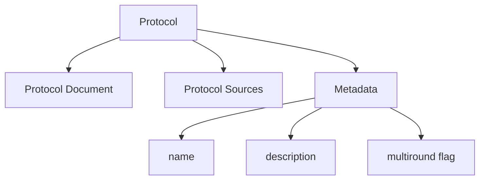
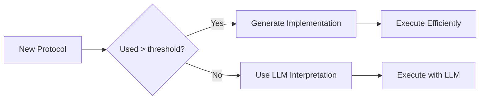

import { Callout, Steps, Step } from "nextra-theme-docs";

# Protocol Management

Protocol management is at the heart of how Agora enables communication between LLM-powered agents. This system handles how protocols are defined, negotiated, executed, and stored throughout their lifecycle.

<Callout type="info">
A protocol in Agora is a structured document that defines how two agents should communicate. It includes metadata about the protocol's purpose and whether it requires multiple rounds of communication.
</Callout>

## Protocol Structure

Each protocol in Agora consists of three main components:

- **Protocol Document** - The actual content defining the communication rules
- **Protocol Sources** - List of locations where the protocol can be retrieved
- **Metadata** - Information about the protocol including name, description, and multiround flag

Here's how a typical protocol is structured:



The metadata section is defined using YAML at the start of the protocol document:

```yaml
---
name: MyProtocol
description: This protocol is for...
multiround: false
---
```

## Protocol Negotiation

When two agents need to communicate but don't have an established protocol, they enter a negotiation phase. This is handled by the negotiator components ([Sender Negotiator](/core-components/sender-components) and [Receiver Negotiator](/core-components/receiver-components)).

<Callout type="warning">
Protocol negotiation is computationally expensive as it requires multiple LLM calls. Agora is designed to reuse existing protocols when possible and only negotiate new ones when necessary.
</Callout>

The negotiation process follows these steps:

<Steps>
### Step 1: Initial Contact

The sender initiates contact with a task schema that defines what needs to be accomplished.

### Step 2: Capability Exchange

The receiver responds with information about its available tools and capabilities.

### Step 3: Protocol Proposal

The agents discuss and refine a protocol that satisfies both parties' requirements.

### Step 4: Agreement

Once both parties agree, the protocol is stored and can be reused for future communications.
</Steps>

## Memory Management

Agora implements a sophisticated memory management system through the `ProtocolMemory` class. This system:

1. Tracks protocol suitability for different tasks
2. Manages conversation history
3. Caches implementations for frequently used protocols

The suitability of a protocol for a task is tracked using an enum:

```python
class Suitability(str, Enum):
    ADEQUATE = 'adequate'
    INADEQUATE = 'inadequate'
    PROBABLY_ADEQUATE = 'probably_adequate'
    PROBABLY_INADEQUATE = 'probably_inadequate'
    UNKNOWN = 'unknown'
```

## Implementation Thresholds

Agora uses an implementation threshold system to optimize protocol execution. After a protocol has been used a certain number of times, it gets compiled into a more efficient implementation:



<Callout>
The default implementation threshold is 5 conversations. This can be configured when initializing the Sender or Receiver components.
</Callout>

For more details on how protocols are stored and retrieved, see [Protocol Storage](/protocol-management/protocol-storage). To understand how protocols are executed, check out [Protocol Execution](/protocol-management/protocol-execution).

## Error Handling

Protocol management includes robust error handling for various scenarios:

- `ProtocolError` - Base class for protocol-related errors
- `ProtocolRejectedError` - When a protocol is deemed unsuitable
- `ProtocolNotFoundError` - When a protocol can't be retrieved
- `ProtocolRetrievalError` - When there are issues downloading a protocol
- `ProtocolTransportError` - When communication between agents fails

Example of error handling in protocol negotiation:

```python
try:
    protocol = self.negotiate_protocol(task_schema, target)
except ProtocolRejectedError:
    # Fall back to natural language communication
    return self.natural_language_conversation(task_schema, target)
```

This robust error handling ensures graceful degradation when issues arise during protocol management.