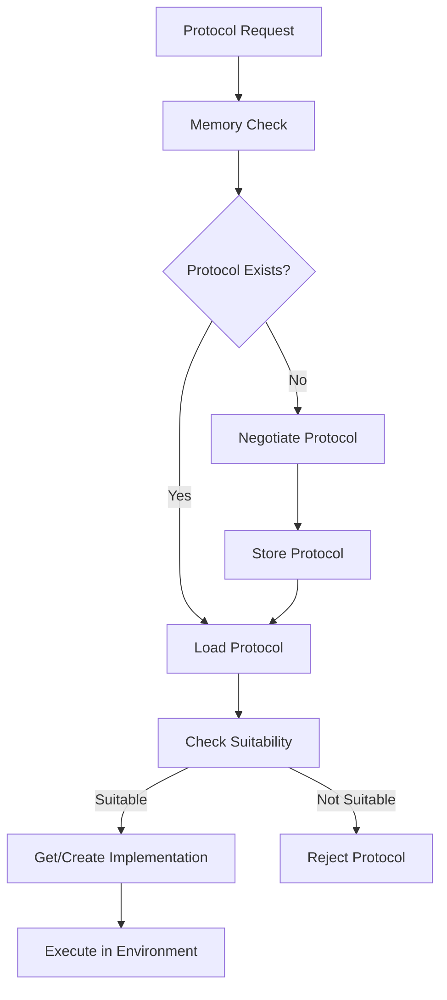

import { Callout, Steps, Step } from "nextra-theme-docs";

# Protocol Execution

Protocol execution is the core process of running protocols between agents in Agora. This section covers how protocols move from negotiation to actual execution, including the safety measures and tooling integration.

<Callout type="info">
Protocol execution in Agora follows the principle of "safe by default, flexible when needed". All protocols run in a restricted environment unless explicitly configured otherwise.
</Callout>

## Execution Flow

When a protocol is executed, it follows this general flow:



## Execution Environment

Agora uses a restricted execution environment by default. The core executor is defined in `RestrictedExecutor`, which inherits from the base `Executor` class:

```python
class RestrictedExecutor(Executor):
    def __call__(self, protocol_id : str, code : str, tools : List[Tool], input_args : list, input_kwargs : dict):
        supported_globals = {
            tool.name : tool.func for tool in tools
        }
        return execute_restricted(code, supported_imports=['json'], function_name='run', extra_globals=supported_globals, input_args=input_args, input_kwargs=input_kwargs)
```

This ensures that protocols:
- Can only access explicitly provided tools
- Have limited import capabilities (default: only 'json')
- Run in a sandboxed environment

## Tool Integration During Execution

Tools are a crucial part of protocol execution. When a protocol runs, it has access to:

- Protocol-specific tools provided during setup
- Basic Python operations
- Restricted standard library functions

<Callout type="warning">
Protocols cannot import arbitrary modules or access system resources directly. This is a security feature to prevent malicious code execution.
</Callout>

## Error Handling

Protocol execution includes robust error handling at multiple levels:

1. **Protocol Level Errors**: Handled through `ProtocolError` and its subclasses:
   - `ProtocolRejectedError`
   - `ProtocolNotFoundError`
   - `ProtocolRetrievalError`
   - `ProtocolTransportError`

2. **Execution Level Errors**: Managed through `ExecutionError`

Example error handling:

```python
try:
    response = conversation(data['body'])
except ProtocolRejectedError:
    return jsonify({
        'status': 'error',
        'message': 'Protocol rejected'
    })
except Exception as e:
    return jsonify({
        'status': 'error',
        'message': str(e)
    })
```

## Multiround Execution

Agora supports both single-round and multi-round protocol execution. Multi-round protocols maintain state between interactions:

```python
class ExecutorConversation(Conversation):
    def __init__(self, executor : Executor, protocol_id : str, code : str, multiround : bool, tools : List[Tool]):
        self.executor = executor
        self.protocol_id = protocol_id
        self.code = code
        self.multiround = multiround
        self.tools = tools
        self.memory = {} if multiround else None
```

<Callout type="info">
Multi-round protocols can store state in `memory` between calls, enabling more complex interactions and maintaining context.
</Callout>

For more on how protocols are stored and retrieved, see [Protocol Storage](/protocol-management/protocol-storage). To understand how tools can be integrated, check out the [Tool Implementation](/tooling/tool-implementation) guide.

## Best Practices

1. **Safety First**: Always use the restricted executor unless you have a specific need for unrestricted execution
2. **Tool Management**: Provide only the tools necessary for the protocol to function
3. **Error Handling**: Implement proper error handling at both protocol and execution levels
4. **State Management**: For multi-round protocols, carefully manage state to prevent memory leaks
5. **Resource Cleanup**: Always clean up resources, especially in multi-round protocols

<Callout type="info">
When implementing custom executors, inherit from the base `Executor` class and implement the required methods while maintaining the security principles of the system.
</Callout>