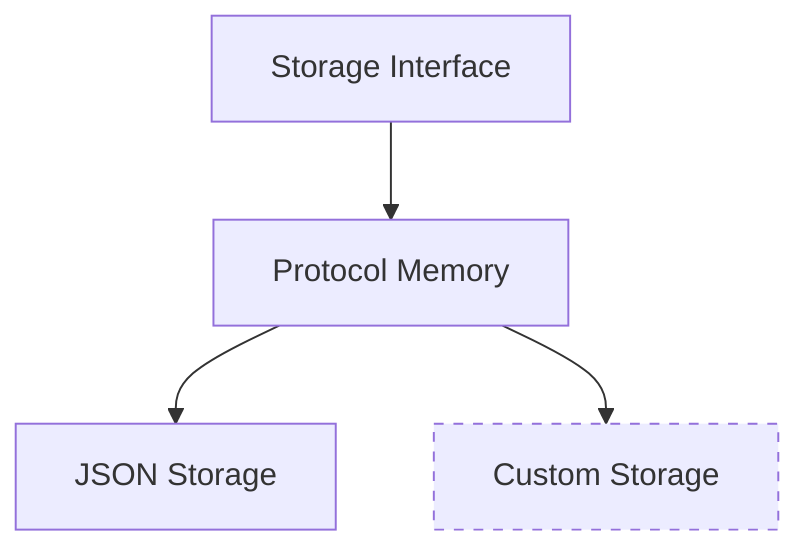

import { Callout, Steps, Step } from "nextra-theme-docs";

# Protocol Storage

Agora maintains a robust system for storing and managing protocols, ensuring they can be efficiently retrieved and reused across conversations. This page covers how protocols are stored, managed, and cached in the system.

<Callout type="info">
The storage system is designed to be extensible - while JSON storage is provided by default, you can implement your own storage backend by extending the `Storage` class.
</Callout>

## Storage Architecture

The protocol storage system consists of three main layers:



## Core Components

### Storage Interface

The base storage interface is defined in `Storage` class, which extends Python's `MutableMapping`:

```python
class Storage(ABC, MutableMapping):
    @abstractmethod
    def save_memory(self):
        pass
    
    @abstractmethod
    def load_memory(self):
        pass
```

This interface ensures all storage implementations provide consistent access patterns and persistence capabilities.

### Protocol Memory

The `ProtocolMemory` class acts as an intermediary layer between your application and the storage backend. It provides high-level operations for protocol management:

- Protocol registration and retrieval
- Implementation caching
- Suitability tracking
- Conversation statistics

<Callout type="warning">
Protocol Memory maintains a cache of active protocols. Make sure to call `save_memory()` on your storage instance if you need persistence between restarts.
</Callout>

### Default JSON Storage

The default storage implementation, `JSONStorage`, stores protocols in a JSON file. Here's a simple example of using it:

```python
from common.storage import JSONStorage
from common.memory import ProtocolMemory

storage = JSONStorage('./protocols.json')
memory = ProtocolMemory(storage)

# Protocols are automatically loaded from the file
# and saved when modified
```

## Protocol Storage Format

Protocols are stored as JSON objects with the following structure:

```json
{
  "protocols": {
    "<protocol_hash>": {
      "document": "<protocol_document>",
      "sources": ["<source1>", "<source2>"],
      "metadata": {
        "name": "Protocol Name",
        "description": "Protocol Description",
        "multiround": false
      },
      "implementation": "<implementation_code>",
      "suitability": {
        "<task_id>": {
          "default": "adequate",
          "overrides": {}
        }
      }
    }
  }
}
```

## Custom Storage Implementation

To implement a custom storage backend:

<Steps>
### Step 1: Create Storage Class

Inherit from `Storage` and implement required methods:

```python
class MyStorage(Storage):
    def save_memory(self):
        # Save state to your backend
        pass
    
    def load_memory(self):
        # Load state from your backend
        pass
```

### Step 2: Implement Dictionary Interface

Implement the required `MutableMapping` methods:

```python
def __getitem__(self, key):
    # Get item logic
    pass

def __setitem__(self, key, value):
    # Set item logic
    pass

def __delitem__(self, key):
    # Delete item logic
    pass
```

### Step 3: Use Your Storage

```python
storage = MyStorage()
memory = ProtocolMemory(storage)
```
</Steps>

## Memory Management

The protocol memory system automatically handles:

- Protocol deduplication (via hashing)
- Implementation caching
- Suitability tracking per task

<Callout type="info">
For large-scale deployments, consider implementing a distributed storage backend that can handle concurrent access and provide better scalability.
</Callout>

## Next Steps

- Learn about [protocol execution](/protocol-management/protocol-execution)
- Understand how [protocols are negotiated](/core-components/sender-components)
- Explore [tool integration](/tooling) for extending functionality