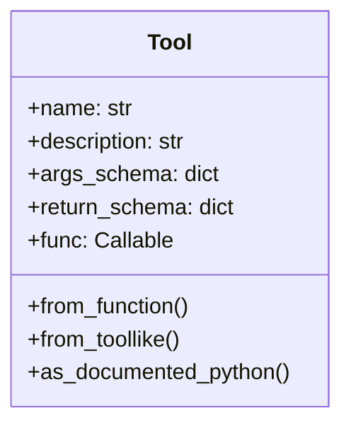
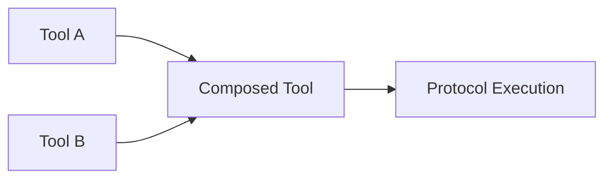

import { Callout, Steps, Step } from "nextra-theme-docs";

# Tooling Integration

The Agora protocol is designed to be highly extensible through a robust tooling system. Tools in Agora represent capabilities that agents can use during communication and protocol execution. This section covers how to work with tools and integrate them into your Agora implementation.

<Callout type="info">
Tools in Agora are more than just functions - they're capabilities that can be discovered, negotiated, and used by agents during protocol execution.
</Callout>

## Understanding Tools

At its core, a tool in Agora is a function with additional metadata that helps agents understand and use it properly. Tools are represented by the `Tool` class which wraps functions with schemas and documentation:



## Key Concepts

### Tool Schemas

Every tool in Agora has both an input and output schema. These schemas define:
- Expected parameters and their types
- Return value types
- Documentation for each parameter
- Additional constraints or requirements

Here's how schemas are structured:

```python
tool = Tool.from_function(
    my_function,
    name="calculate",
    description="Performs a calculation",
    args_schema={
        "x": {"type": "number", "description": "First number"},
        "y": {"type": "number", "description": "Second number"}
    },
    return_schema={
        "type": "number",
        "description": "The result"
    }
)
```

### Tool Discovery

Tools can be discovered and used dynamically by agents. The protocol provides mechanisms for:
- Tool registration and management
- Capability negotiation between agents
- Runtime tool availability checking

<Callout type="warning">
Tools must be explicitly provided to agents - they can't access arbitrary functions for security reasons.
</Callout>

## Managing Tools

### Tool Registration

Tools need to be registered with both senders and receivers. You can register tools when creating components:

```python
receiver = Receiver.make_default(
    toolformer,
    tools=[tool1, tool2],
    additional_info="Extra context about available tools"
)
```

### Tool Execution

Tools are executed in a restricted environment to ensure safety. The `RestrictedExecutor` class manages tool execution with:
- Sandboxed execution environment
- Limited import capabilities 
- Memory usage controls

## Integration Patterns

### Function Wrapping

The simplest way to create a tool is by wrapping an existing function:

```python
@tool(
    name="greet",
    description="Generates a greeting"
)
def generate_greeting(name: str) -> str:
    return f"Hello, {name}!"
```

### Tool Composition

Tools can be composed to create more complex capabilities:



## Next Steps

To dive deeper into tool implementation, check out:
- [Tool Implementation](/tooling/tool-implementation) for creating custom tools
- [LLM Integration](/tooling/llm-integration) for connecting different language models

<Callout>
Remember that tools are the primary way agents interact with their environment. Well-designed tools make for more capable and efficient agent interactions.
</Callout>

## Security Considerations

Tools run in a restricted environment by default. Key security features include:
- Restricted imports through whitelist
- Memory and computation limits
- No filesystem access
- Sandboxed execution context

```python
# Example of restricted execution
executor = RestrictedExecutor()
result = executor(
    protocol_id,
    code,
    tools,
    input_args,
    input_kwargs
)
```

The restricted environment helps prevent malicious code execution while still allowing useful tool functionality.