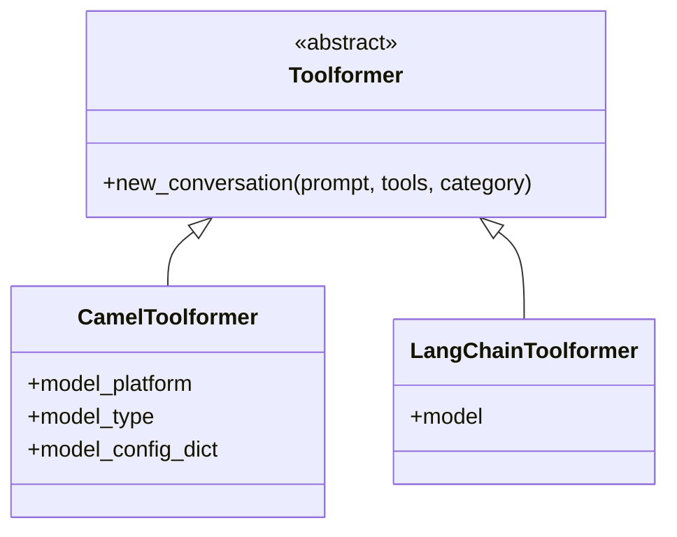

import { Callout, Steps, Step } from "nextra-theme-docs";

# LLM Integration

Agora is designed to work with various Large Language Model providers through a unified interface. This flexibility allows you to use your preferred LLM backend while maintaining consistent protocol handling.

<Callout type="info">
Currently, Agora supports integration with CAMEL and LangChain out of the box, with room for custom implementations through the Toolformer interface.
</Callout>

## Architecture Overview



The integration is built around the `Toolformer` abstract base class, which provides a standard interface for different LLM backends. The key method that needs to be implemented is `new_conversation()`, which creates a conversation context with the LLM.

## Using CAMEL Integration

CAMEL is a framework for building autonomous agents. Agora provides native support through the `CamelToolformer` class.

<Steps>
### Step 1: Initialize CAMEL Toolformer

```python
from camel.models import ModelFactory
from common.toolformers.camel import CamelToolformer

toolformer = CamelToolformer(
    model_platform="openai",  # or other supported platforms
    model_type="gpt-4",      # model type
    model_config_dict={}     # additional configuration
)
```

### Step 2: Create Conversations

```python
conversation = toolformer.new_conversation(
    prompt="Your system prompt here",
    tools=[your_tools],  # list of Tool objects
    category="conversation"  # optional category
)
```
</Steps>

## Using LangChain Integration

LangChain provides a unified interface to various LLM providers. Agora's LangChain integration automatically handles the conversion between Agora's Tool format and LangChain's function calling format.

<Steps>
### Step 1: Initialize LangChain Toolformer

```python
from langchain_core.language_models import BaseChatModel
from common.toolformers.langchain import LangChainToolformer

# Initialize your LangChain model
model = YourLangChainModel()  # extends BaseChatModel

toolformer = LangChainToolformer(model)
```

### Step 2: Create Conversations

```python
conversation = toolformer.new_conversation(
    prompt="Your system prompt here",
    tools=[your_tools],
    category="conversation"
)
```
</Steps>

## Implementing Custom Integrations

You can create custom integrations by implementing the `Toolformer` abstract base class. This is useful when you want to use an LLM provider that isn't supported by CAMEL or LangChain.

<Steps>
### Step 1: Create Your Toolformer Class

```python
from common.toolformers.base import Toolformer, Conversation

class CustomToolformer(Toolformer):
    def __init__(self, your_config):
        self.config = your_config
        
    def new_conversation(self, prompt: str, tools: List[ToolLike], category=None) -> Conversation:
        # Implement your conversation creation logic here
        return YourConversationImplementation()
```

### Step 2: Implement Conversation Class

```python
class CustomConversation(Conversation):
    def __call__(self, message: str, print_output=True):
        # Implement your message handling logic here
        return response
```
</Steps>

## Best Practices

When working with LLM integrations in Agora, keep these guidelines in mind:

- **Tool Consistency**: Tools should be model-agnostic. The same tools should work across different LLM backends.
- **Error Handling**: Implement proper error handling in your conversations. LLMs can be unpredictable.
- **Memory Management**: Be mindful of conversation state, especially in long-running processes.
- **Cost Efficiency**: Structure your prompts and tools to minimize the number of LLM calls needed.

<Callout type="warning">
Remember that different LLM providers have different rate limits, costs, and capabilities. Design your implementations accordingly.
</Callout>

## Related Topics

- Learn about tool implementation in the [Tool Implementation](/tooling/tool-implementation) section
- Understand protocol execution in the [Protocol Execution](/protocol-management/protocol-execution) section
- See how components interact in the [Core Components](/core-components) overview