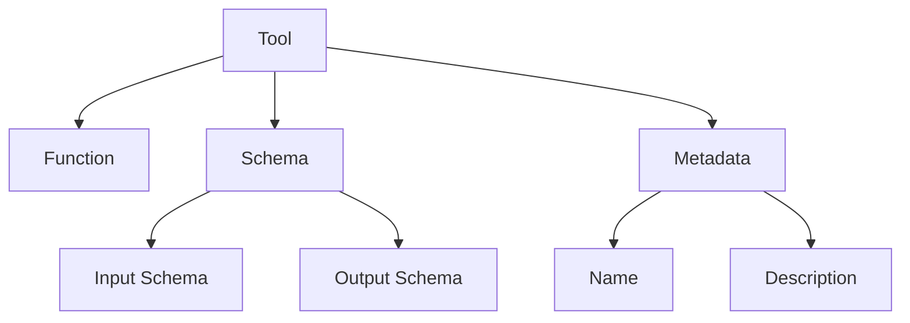

import { Callout, Steps, Step } from "nextra-theme-docs";

# Tool Implementation

Tools in Agora are functions or callable objects that can be executed by agents during protocol execution. The tool system is designed to be flexible, type-safe, and easy to integrate with both LLMs and existing codebases.

<Callout type="info">
Tools are the primary way agents interact with the outside world. They can be anything from simple utility functions to complex integrations with external services.
</Callout>

## Basic Tool Structure

A tool in Agora consists of three main components:
- A function or callable object that performs the actual work
- A schema that describes its inputs and outputs
- Metadata like name and description

Here's how these components fit together:



## Creating Tools

<Steps>
### Step 1: Define Your Function

Start by creating a Python function with type hints and docstrings:

```python
def calculate_average(numbers: List[float]) -> float:
    """
    Calculate the average of a list of numbers.
    
    Args:
        numbers (List[float]): List of numbers to average
        
    Returns:
        float: The calculated average
    """
    return sum(numbers) / len(numbers)
```

### Step 2: Convert to Tool

Use the `Tool.from_function()` method to create a tool:

```python
from common.toolformers.base import Tool

average_tool = Tool.from_function(calculate_average)
```

### Step 3: Add to Agent

Add the tool to your agent's toolset:

```python
agent = Receiver.make_default(toolformer, tools=[average_tool])
```
</Steps>

## Advanced Tool Creation

For more complex scenarios, you can explicitly define schemas and customize tool behavior:

```python
tool = Tool(
    name="custom_tool",
    description="A custom tool with explicit schema",
    args_schema={
        "input_data": {
            "type": "object",
            "properties": {
                "field1": {"type": "string"},
                "field2": {"type": "number"}
            }
        }
    },
    return_schema={
        "type": "object",
        "properties": {
            "result": {"type": "string"}
        }
    },
    func=my_custom_function
)
```

<Callout type="warning">
When creating tools with explicit schemas, ensure your function's implementation matches the schema exactly. Mismatches can cause runtime errors.
</Callout>

## Tool Validation and Safety

Agora provides a restricted execution environment for tools through the [RestrictedExecutor](/protocol-management/protocol-execution). This ensures tools can't perform unauthorized operations:

```python
from common.executor import RestrictedExecutor

executor = RestrictedExecutor()
# Tools run through this executor can only access whitelisted operations
```

## Best Practices

1. **Documentation**: Always provide clear docstrings and type hints. LLMs use these to understand tool functionality.

2. **Error Handling**: Tools should handle errors gracefully and provide clear error messages:

```python
def safe_tool(input_data: dict) -> dict:
    try:
        result = process_data(input_data)
        return {"status": "success", "data": result}
    except ValueError as e:
        return {"status": "error", "message": str(e)}
```

3. **Schema Design**: Keep schemas simple and explicit. Use standard JSON schema types when possible.

4. **Testing**: Test tools independently before adding them to agents:

```python
def test_tool():
    tool = Tool.from_function(my_function)
    result = tool.func(test_input)
    assert result == expected_output
```

## Integration with LLMs

Tools automatically integrate with supported LLM backends through the [toolformer interface](/tooling/llm-integration). The schema and documentation are converted to formats that LLMs can understand and use effectively.

<Callout>
The better documented and typed your tool is, the more effectively LLMs can use it in protocols. Always aim for clarity and completeness in tool definitions.
</Callout>

## Common Pitfalls

- **Over-complexity**: Keep tools focused on single responsibilities
- **Undefined Behaviors**: Tools should have predictable outputs for all valid inputs
- **Missing Documentation**: Tools without proper docs may be ignored by LLMs
- **State Management**: Tools should be stateless unless absolutely necessary

For more advanced scenarios like integrating with specific LLM providers, check out the [LLM Integration](/tooling/llm-integration) guide.